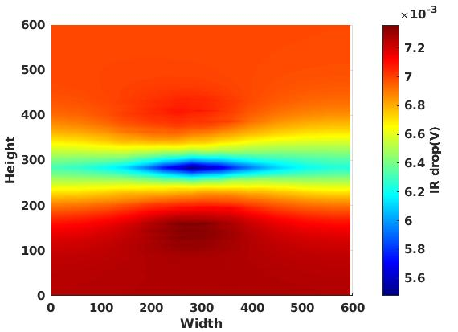

# OpenIRA
[](https://en.wikipedia.org/wiki/C%2B%2B#Standardization)
[](https://github.com/VidyaChhabria/PDNA/archive/master.zip)
[](https://github.com/VidyaChhabria/PDNA/tree/master)
[](https://github.com/VidyaChhabria/PDNA/issues)
[](https://opensource.org/licenses/BSD-3-Clause)

OpenIRA: Open-source static power-grid IR analyzer




## Getting Started

### Clone Repository and Submodules
`git clone --recursive https://github.com/VidyaChhabria/OpenIRA.git`

### Inputs
* DEF : Placed and PDN synthesized
* LEF : Tech and Cell LEF
* LIB : Liberty files for OpenSTA power report
* Verilog : Gate-level netlist for OpenSTA power report
* SDC : Constraints for OpenSTA power report
* VSRC.loc: Voltage source location [file](test/gcd/Vsrc.loc)

###  Outputs
* Static IR drop report, worst case IR drop
* Static IR drop plots


### Dependencies:
- [OpenDB](https://github.com/The-OpenROAD-Project/OpenDB/tree/develop)
- [OpenSTA](https://github.com/The-OpenROAD-Project/OpenSTA)
- [SuperLU](https://github.com/xiaoyeli/superlu)
   

### Install and Run on Bare Metal Machine

#### Pre-requisutes
- GCC compiler and libstdc++ static library >= 4.8.5
- TCL > = 8.4
- BLAS library >= 3.8 for SuperLU
- FORTRAN compiler
- Boost Libraries >= 1.53

#### Build and Install

After  cloning the repository and its submodules, build and install using the
following commands:

```
$ cd OpenIRA
$ mkdir build
$ cd build
$ cmake ..
$ make
```


#### Check the Installation
- To make sure your installation is correct and the current tool version is
  stable:

```
$ ./irsolver
% source ../test/gcd_test.tcl
```


### Usage
|  |
|:--:|
| *Example usages with TCL interpreter* |

Open the TCL interpreter for OpenIRA.


`$ openira`

Run the following TCL commands:

```
OpenIRA ira
ira import_lef /path/to/lef/file.lef
ira import_def /path/to/def/file.def
ira import_verilog /path/to/gate-level/netlist/file.v
ira set_top_module moduleName
ira import_sdc /path/to/constraints/file.sdc 
ira import_lib /path/to/liberty/file.lib
ira read_voltage_src /path/to/Vsrc.loc
ira analyze_power_grid
```

The analyze_power_grid command supports the following optional arguments:
analyzer_power+grid -layer <str> -net VDD/VSS


analyze_power_grid -layer M1 -net VSS

| Argument          | Comments                                                                             	|
|-------------------|--------------------------------------------------------------------------------------	|
| layer <str>       | Reports the worst case IR on the specifed layer and plots the IR map (optional, str)  |
| net <str>         | Specifies which net to analyze: VDD/VSS (optional, str)   	                        |


If the above two arguments are not specified, the default arguments are net VSS and layer 1.

## License
The rest of this repository is licensed under BSD 3-Clause License.

>BSD 3-Clause License
>
>Copyright (c) 2019, The Regents of the University of Minnesota
>
>All rights reserved.
>
>Redistribution and use in source and binary forms, with or without
>modification, are permitted provided that the following conditions are met:
>
>* Redistributions of source code must retain the above copyright notice, this
>  list of conditions and the following disclaimer.
>
>* Redistributions in binary form must reproduce the above copyright notice,
>  this list of conditions and the following disclaimer in the documentation
>  and/or other materials provided with the distribution.
>
>* Neither the name of the copyright holder nor the names of its
>  contributors may be used to endorse or promote products derived from
>  this software without specific prior written permission.
>
>THIS SOFTWARE IS PROVIDED BY THE COPYRIGHT HOLDERS AND CONTRIBUTORS "AS IS"
>AND ANY EXPRESS OR IMPLIED WARRANTIES, INCLUDING, BUT NOT LIMITED TO, THE
>IMPLIED WARRANTIES OF MERCHANTABILITY AND FITNESS FOR A PARTICULAR PURPOSE ARE
>DISCLAIMED. IN NO EVENT SHALL THE COPYRIGHT HOLDER OR CONTRIBUTORS BE LIABLE
>FOR ANY DIRECT, INDIRECT, INCIDENTAL, SPECIAL, EXEMPLARY, OR CONSEQUENTIAL
>DAMAGES (INCLUDING, BUT NOT LIMITED TO, PROCUREMENT OF SUBSTITUTE GOODS OR
>SERVICES; LOSS OF USE, DATA, OR PROFITS; OR BUSINESS INTERRUPTION) HOWEVER
>CAUSED AND ON ANY THEORY OF LIABILITY, WHETHER IN CONTRACT, STRICT LIABILITY,
>OR TORT (INCLUDING NEGLIGENCE OR OTHERWISE) ARISING IN ANY WAY OUT OF THE USE
>OF THIS SOFTWARE, EVEN IF ADVISED OF THE POSSIBILITY OF SUCH DAMAGE.
